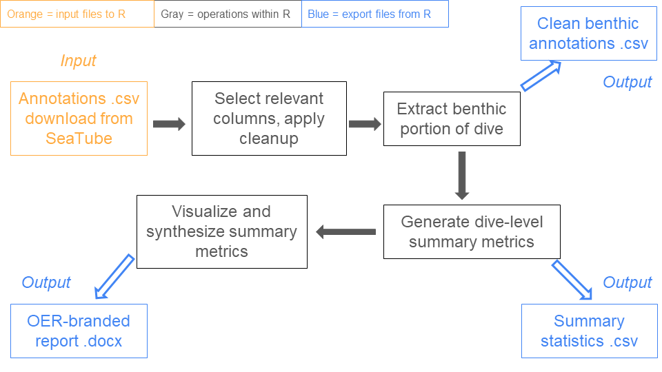

# Ocean Exploration benthic annotations reporting

Uses locally stored SeaTube annotation .csv files Annotations can be groups of dives saved as single .csv files or a combined .csv file with multiple dives.

Pulls dive summary .txt files from [NCEI](https://www.ncei.noaa.gov/waf/okeanos-rov-cruises/) to filter for the benthic portion of each individual dive within the group.

Scripts are provided for the following: 1. Benthic_anntations_cleaning: import local SeaTube annotation .csv files, extract annotation taxonomy and relevant ancillary ROV and environmental data, automatically download corresponding dive summary .txt files, use these .txt files to select only the annotations made while the ROV was on the seafloor, and create output .csv file of cleaned benthic annotations for use in the summary statistics and taxonomic distinctness scripts 2. Benthic_summary_statistics: import cleaned and formatted .csv from the Benthic_annotations_cleaning script, and generate metrics including total substrate/geoform annotations, total biological annotations, percentage of annotations flagged for review, unidentified biological annotations, biological annotations by taxonomic level, and ROV bottom time in hours. The summary statistics output as a .csv file for use in a quarto document that is in development. 3. Taxonomic_distinctness: import cleaned and formatted .csv from the Benthic_annotations_cleaning script, and use the vegan package to calculate the taxonomic distinctness biodiversity metric for each dive. Currently the data are converted to presence/absence form before performing the analysis. Highly recommend reviewing the dive summary statistics before selecting which dives to include in the analysis. The script calculates the number of unique taxa at each taxonomic level for each dive and creates visualizations, to inform selection of the appropriate taxonomic level to conduct the taxonomic distinctness analysis. The unique taxa visualizations and the visualizations of the taxonomic distinctness metric across groups of dives are exported as png files. A boxplot outlier detection method is used to flag unusual values across a group of dives, and a visualization of these results is also exported as a .png. The metrics generated within the taxonomic distinctness analysis are exported as a .csv file.
